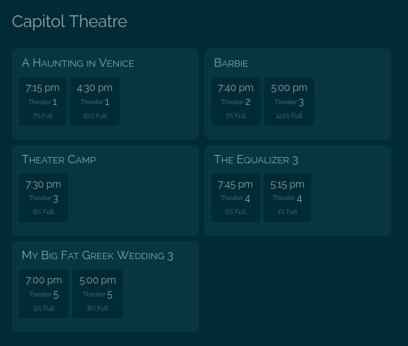
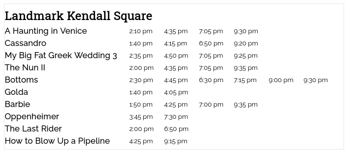

# Movie Times for Home Assistant
This project defines a sensor that puts movie times in its attributes. I mostly just use this because I like seeing this kind of info on a dashboard I keep around, but who knows, maybe you could use it for some kind of funky automation or something...

Unfortunately, I couldn't find any legit APIs for movie times that weren't way too expensive for this sort of thing, and I'm not super convinced those APIs would have accurate data for the smaller theaters I tend to go to. So I had to fall back on scraping the websites, and only implemented the theaters I care about.

#### Update February 2023
Eventually, I noticed that Fandango has an undocumented API that wasn't too tricky to figure out, so now this integration can handle any theater on there. Of course, this is an unofficial API, so it could fall apart at any time.

#### Update September 2023
The Somerville and Capitol theaters have switched to [this ticketing service](https://veezi.com/en-us), so I've added support for it (it was even [documented!](https://api.us.veezi.com/Help/Introduction)).

Interestingly, the new platforms exposes how many tickets were sold, so there's a new `percent_full` value for each showtime on the sensors for these theaters. This doesn't seem 100% accurate — I've seen showtimes with more tickets sold than seats. Also, the sensor only scans hourly, so it may not reflect recent ticket sales, especially shortly before a showtime when lots of people are buying tickets at the theater. In general, this might be useful, but it probably isn't totally reliable.

I've kept the hard coded `scraper` options for these theaters so you don't have to dig around and find the tokens you need. It's possible this could become another generic option, but I don't think the necessary tokens would be get-able most other theaters using this service. I could possibly make it generic by scraping [these pages](https://ticketing.useast.veezi.com/sessions/47hkrx909r6ew1rvdr79yr16cr), but some info is missing on them (theater number, seats sold) and the JSON from the API is way easier to deal with. If more theaters move to this service, I might take another look opening it up beyond Somerville and The Capitol.

## Installation
Throw the files in `custom_components` or point HACS at this repo.

For the config, put in something like this:
```
sensor:
  - platform: movie_times
    name: Movie Times
    next_days: 0
    filter_past_shows: true
    theaters:
      # To find the id, look for the five character code in the URL, for example, Landmark Kendall Square's
      # URL is https://www.fandango.com/landmark-kendall-square-cinema-aaeis/theater-page and its ID is "AAEIS"
      - theater_name: Landmark Kendall Square
        scraper: fandango
        theater_id: AAEIS
        split_formats: true

      # These theaters may have more info (the "details" field, the theater number, percent full),
      # but they're only going to be useful if you live in metro Boston
      - theater_name: The Brattle Showtimes
        scraper: brattle
        show_details: true
      - theater_name: Coolidge Corner Showtimes
        scraper: coolidge
        show_screen: true
        show_details: true
      - theater_name: Somerville Theatre Showtimes
        scraper: somerville
        show_screen: true
        show_details: true
      - theater_name: Capitol Theatre Showtimes
        scraper: capitol
        show_screen: true
        show_details: true
```
`next_days` is the number of days into the future to include — `0` means to only show today, `1` means to show today and tomorrow, and so on. It's probably useless to make this very big, because not all of these theaters schedule stuff very far out. This is optional and defaults to `0`.

`filter_past_shows` controls whether or not showtimes today that have already happened will appear. This is optional and defaults to `false`. By default, the sensor updates hourly, so this might be a little delayed if enabled.

`show_screen` and `show_details` are options for some scrapers. They are both optional, and default to `false`. Each theater gives different details, but it's usually stuff like the format or what rep series a screening falls under.

The `split_formats` option for Fandango chooses whether or not showtimes for different formats of the same movie (Standard, 3D, IMAX, etc) are lumped under the same title or are listed separately. Defaults to `false`.

## Lovelace Cards

While you could write some cool automation about the next movie playing at your neighborhood theater or something, you might just want to movie times on your dashboard. That's all I really do with it after all...

I didn't want to go to the effort of making real cards though, so my solution is a little hacky. I listed what I did [over here](readme/LOVELACE.md). Screenshots below.

 
