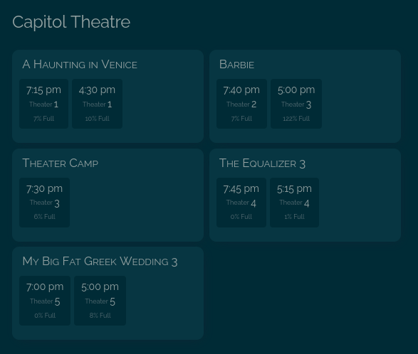

# Frontend
I didn't bother making a real lovelace card for this, but here's a couple quick and dirty configs you could try out if you install [Lovelace HTML Jinja2 Template Card](https://github.com/PiotrMachowski/Home-Assistant-Lovelace-HTML-Jinja2-Template-card) and [Decluttering Card](https://github.com/custom-cards/decluttering-card).

There's a decent chance you'll need to mess with these. For some theaters (especially huge city-center multiplexes) the list of showtimes can get long enough to break fancy layouts. These should be an okay starting point though.

## Big Cards
This exposes most of the available info, includes ticket sales links, etc.



```
decluttering_templates:
  movie_showtime_card:
    default:
      - header_text: Change Me!
      - theater_entity: Change Me!
    card:
      type: custom:html-template-card
      title: '[[header_text]]'
      ignore_line_breaks: true
      entities: '[[theater_entity]]'
      content: |
        <div class="movie-container">
          
          <div class="movie">
            <div class="movie-title">
              {{ movie['name'] }}
            </div>
            
            
            
              <br>
            
            <div class='detail'>
              {{ detail }}
            </div>
            
            
            <div class="showtime-container">
              
              <a target="_blank" rel="noopener noreferrer"  href="{{show['link']}} ">
                <div class="showtime">
                  {{show['time']}}
                  
                  <br>
                  <span class="theater-label">Theater </span>{{show['screen']}}
                  
                  
                  <br>
                  <span class="theater-label">{{show['percent_full']}}% Full</span>
                  
                </div>
              </a>
              
            </div>
          </div>
          
          <div class="movie">
            <div class="movie-title">
              No Showtimes
            </div>
          </div
          
        </div>
        <style>
          .movie-container {
            display: flex;
            flex-flow: row wrap;
            justify-content: flex-start;
            gap: 7.5px;
          }
          .movie {
            background: var( --ha-card-background, var(--card-background-color, white) );
            border-radius: var(--ha-card-border-radius, 10px);
            box-shadow: var( --ha-card-box-shadow, 0px 2px 1px -1px rgba(0, 0, 0, 0.2), 0px 1px 1px 0px rgba(0, 0, 0, 0.14), 0px 1px 3px 0px rgba(0, 0, 0, 0.12) );
            padding: 10px;
          }
          @media all and (min-width:600px) {
            .movie {
              width: calc(50% - 10px - 20px);
            }
          }
          @media not all and (min-width:600px) {
            .movie {
              width: 100%;
            }
          }
          .movie-title {
            padding-top: 0px;
            padding-left: 0.25em;
            font-size: 1.2em;
            font-variant: small-caps;
            display: inline;
          }
          .detail {
            font-size: 0.8em;
            color: var(--disabled-text-color);
            padding: 2.5px;
            padding-right: 5px;
            padding-left: 5px;
            margin-right: 1em;
            display: inline-block;
            text-align: center;
          }
          .showtime-container {
            display: flex;
            flex-flow: row wrap;
            justify-content: flex-start;
            gap: 5px;
            margin-top: 10px;
            margin-bottom: 10px;
          }
          .showtime {
            font-size: 1em;
            background: var(--background-color);
            padding: 5px;
            padding-right: 10px;
            padding-left: 10px;
            border-radius: var(--ha-card-border-radius, 4px);
            display: inline-block;
            text-align: center;
          }
          .theater-label {
            font-size: 0.65em;
            vertical-align: top;
            color: var(--disabled-text-color);
          }
          a {
            color: inherit;
            text-decoration: inherit;
          }
          ha-card {
            background: none;
            box-shadow: none;
          }
        </style>
```

## Compact Cards
I made this one for an e-ink dashboard. It doesn't include as much info and uses a far more compact layout.


```
decluttering_templates:
  compact_movie_showtime_card:
    default:
      - header_text: Change Me!
      - theater_entity: Change Me!
    card:
      type: custom:html-template-card
      title: '[[header_text]]'
      ignore_line_breaks: true
      entities: '[[theater_entity]]'
      content: |
        <div class="movie-container">
          
          <div class="movie">
            <div class="movie-title">
              {{ movie['name'] }}
            </div>
            <div class="showtime-container">
              
              <a target="_blank" rel="noopener noreferrer"  href="{{show['link']}} ">
                <div class="showtime">
                  {{show['time']}}
                </div>
              </a>
              
            </div>
          </div>
          
          <div class="movie">
            <div class="movie-title">
              No Showtimes
            </div>
          </div
          
        </div>
        <style>
          .movie-container {
            justify-content: flex-start;
          }
          .movie {
            display: flex;
            align-items: center;
            background: var( --ha-card-background, var(--card-background-color, white) );
            border-radius: var(--ha-card-border-radius, 4px);
            box-shadow: var( --ha-card-box-shadow, 0px 2px 1px -1px rgba(0, 0, 0, 0.2), 0px 1px 1px 0px rgba(0, 0, 0, 0.14), 0px 1px 3px 0px rgba(0, 0, 0, 0.12) );
            width: 100%;
            padding-bottom: 5px;
          }
          .movie-title {
            padding-top: 0px;
            padding-right: 0.25em;
            font-size: 1.2em;
            font-weight: 600;
            width: 250px;
            white-space: nowrap;
            overflow: hidden;
            text-overflow: ellipsis;
          }
          .showtime-container {
            display: flex;
            flex-grow: 1;
            gap: 10px;
          }
          .showtime {
            font-size: 0.95em;
            text-align: left;
            width: 65px;
          }
          a {
            color: inherit;
            text-decoration: inherit;
          }
          .card-header {
            font-weight: 600 !important;
            padding-bottom: 5px !important;
            line-height: 32px;
          }
          ha-card {
            padding-left: 22px !important;
            padding-top: 0px !important;
            padding-bottom: 2px !important;
            background: none;
            box-shadow: none;
          }
        </style>
```
